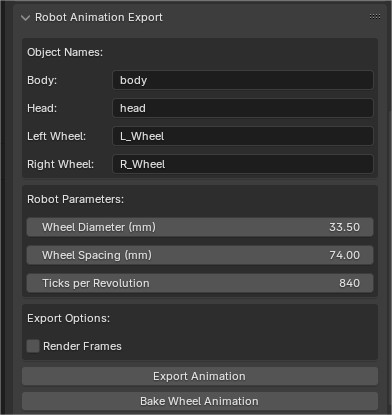

# Playbot Exporter



A Blender addon to export Playbot robot animations to a firmware-compatible format. The addon automatically calculates wheel rotations and head servo positions, and can also generate animation renders.

## 🚀 Installation

1. Download the `Playbot_Exporter.py` file
2. In Blender, go to `Edit > Preferences > Add-ons`
3. Click `Install...` and select the `Playbot_Exporter.py` file
4. Enable the addon by checking its checkbox

📋 Prerequisites

Blender 4.2.3 LTS (recommended)
Compatible with Blender 4.2.x versions
A Playbot robot rig with the following objects:

Body
Head
Left wheel (L_Wheel)
Right wheel (R_Wheel)

## 🎮 Usage

### Configuration

1. In Blender, open the Properties panel and select the Output tab
2. Find the "Robot Animation Export" section
3. Configure the following parameters:

#### Object Names
- Body name (default: "body")
- Head name (default: "head")
- Left wheel name (default: "L_Wheel")
- Right wheel name (default: "R_Wheel")

#### Robot Parameters
- Wheel Diameter (mm): Physical diameter of the wheels
- Wheel Spacing (mm): Distance between wheel centers
- Ticks per Revolution: Number of encoder ticks per wheel revolution

### Features

#### Export Animation Data
1. Set up your animation in Blender
2. Click "Export Animation"
3. Choose a save location for the output file
4. The exported file will contain frame-by-frame data in the format:
   ```
   frame/servo_microseconds/right_wheel_ticks/left_wheel_ticks
   ```

#### Bake Wheel Animation
- Click "Bake Wheel Animation" to calculate and apply wheel rotations directly in Blender
- This is useful for previewing the robot's movement in the 3D viewport

#### Render Frames
- Enable "Render Frames" to automatically generate PNG renders of each frame
- Images will be saved in a "_frames" folder next to the exported data file

## 🔧 Technical Details

### Export Format
Each line in the exported file contains:
- Frame number
- Head servo position (in microseconds, 500-2400µs)
- Cumulative right wheel encoder ticks
- Cumulative left wheel encoder ticks

### Calculations
- Wheel rotations are calculated based on the robot's movement and turning radius
- Servo positions are mapped from Blender's rotation angles to microseconds
- Encoder ticks are calculated using the specified ticks per revolution

📝 Notes

Ensure your animation is properly set up before exporting
The robot's body movement drives the wheel calculations
Head rotation directly controls the servo position
Overlays are automatically hidden during frame rendering for clean output
Important: The robot cannot move forward/backward and turn at the same time. Each movement must be separated into distinct actions:

First complete the turn, then move forward/backward
Or first complete the forward/backward movement, then turn
Combining these movements in the same frame will result in incorrect wheel calculations

## 🤝 Contributing

Feel free to submit issues and enhancement requests!

## 📄 License

[MIT License](LICENSE)

## 🙏 Credits

Developed by Guillaume Loquin