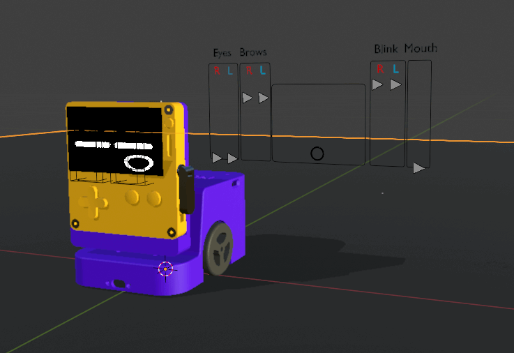
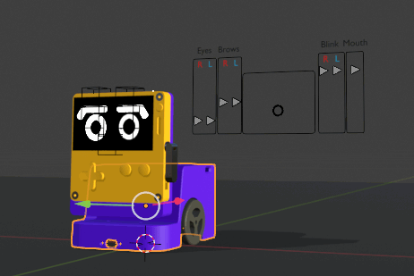
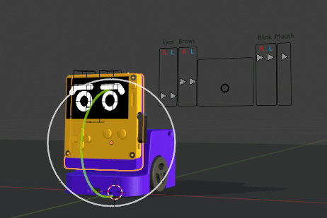
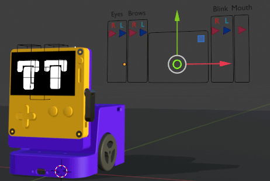
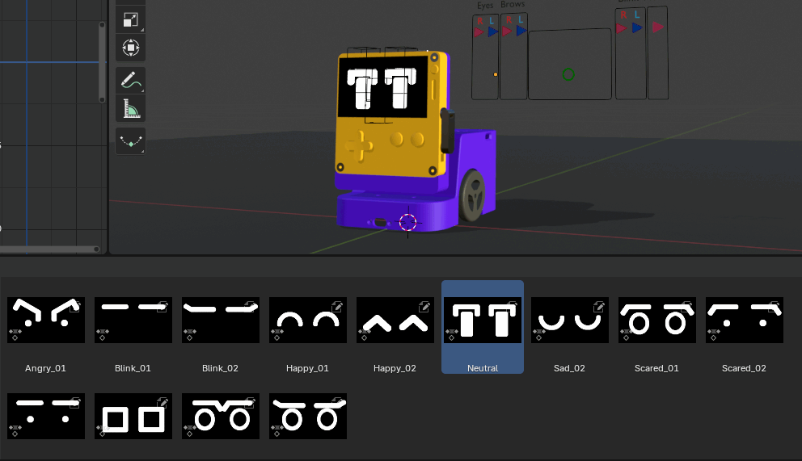
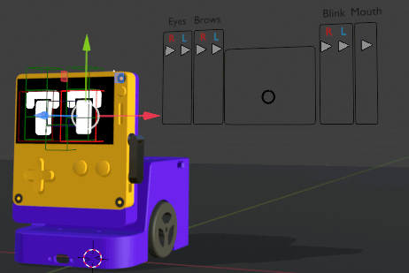

# Playbot blender rig  

## How to use
### move and rotate the robot

The robot's body movement drives the wheel calculations.
**Important:** The robot cannot move forward/backward and turn at the same time. Each movement must be separated into distinct actions:

First complete the turn, then move forward/backward Or first complete the forward/backward movement, then turn.
Combining these movements in the same frame will result in incorrect wheel calculations

### rotate the head 

Head rotation directly controls the servo position. Rotation constraints prevent exceeding physical rotation limits.

### Expression controller 

In **pose mode**, you can cycle through various expression images for eyes and eyebrows, along with blink and mouth controls.

#### Expressions library 

To help speed up your animation process, you can also access a library of pre-built expressions.

### Bones controller

You can also fine tune transformations for each facial bones.